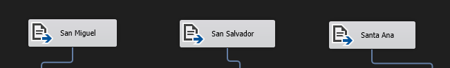

# Datawarehouse y Minería de Datos: Desafio 1
### Descripción

Se nos solicita un sistema ETL para resolver este problema:

La Floristería "Fiorella" quiere saber cómo se compran sus productos y tiene la data de tres departamentos del país. Por ello, solicita su opinión sobre qué productos sobresalen, qué combinaciones son mejores y desea este estudio tanto por departamento como a nivel nacional.

Finalmente, los datos se cargarán en dos archivos de Excel: "Preferencias_Departamentales.xlsx" y "Preferencias_Nacionales.xlsx", incorporando el análisis de tendencias y patrones de compra.

## Tecnologías Utilizadas:
Visual Studio Code
Data Storage and Processing (Extensión de Visual Studio)
SQL Server Integration Services (SSIS)
Excel

## Ejecución
*Parte1*
En el repositorio se encuentra una carpeta llamda "recursos desafio 1"

Dentro de esta carpeta encontrarás los archivos tipo CSV que corresponden a cada departamento mencionado en el problema a resolver.

*Parte2*
Luego de ubicar los archivos correspondientes, se procedera a configurar los conection manager de cada flat source que se encuentra al inicio del flujo.

*Parte3*
De igual manera para los archivos excel, se procedera a conectar el archivo Excel correspondiente, guiarse por el nombre de los componentes Excel Destination.

*Componentes Excel Destination que conectan a archivo Excel Preferencias_Departamentales (Ubicado en la carpeta de recursos):
San Miguel Productos, Mapping con Sheet "San Miguel"
San Salvador Productos, Mapping con Sheet "San Salvador"
San Ana Productos, Mapping con Sheet "San Ana"
Departamental, Mapping con Sheet "Departamental"

*Componentes Excel Destination que conectan a archivo Excel Preferencias_Nacionales (Ubicado en la carpeta de recursos):
Nacional Por Productos, Mapping con Sheet "Nacional"
Nacional Total Productos, Mapping con Sheet "Nacional Totales"

Para observar como funciona el programa, se procederá a ejecutar el parquete al clickear 
"Excecute Package" dentro de Solution Explorer a su derecha

Luego de que el programa se ejecute, comprobar los resultados en las hojas de excel.

Nota: La carpeta Muestras dentro de Recursos son los archivos Excel con los resultados del análisis de datos, pueden utilizarse para comprobar la respuesta con los originales que se encuentran en la misma carpeta de recursos.

## Desarrollador:
* Carlos Francisco Peña Herrera